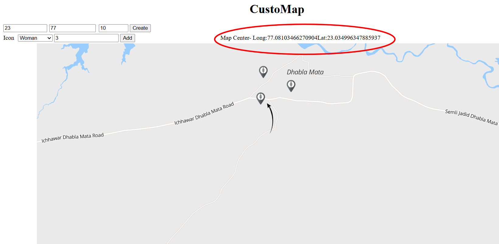
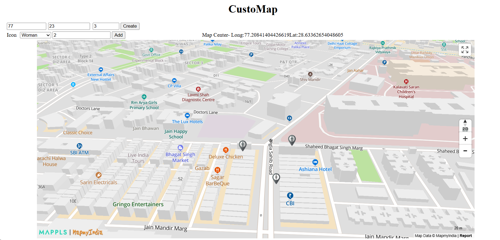

# Scene Map

Powered by <br>


Currently, in Indian judicial system the prosecution presents a physical document denoting the map of crime/accident scene/property disputes. Using the [Mappls API](https://about.mappls.com/api/) a scene map creator has been developed to fully digitize the process. The software renders the map based on fed co-ordinates and the customizable markers represent the entities/evidences present at the scene.

## Table of Contents

- [Features](#features)
- [Installation](#installation)
- [Usage](#usage)
- [Screenshots](#screenshots)
- [License](#license)
- [Contact](#contact)

## Features

- A fully digized process for renderding accurate marking of scene maps using real-time and precise map data hance reducing human error.
- New markers can easily be added according to the need of the case hence making it a flexible tool.
- Two or more considerably different locations can be depicted on the map at the same time unlike using sperate physical maps which can create confusion.
- Dynamic 2D/3D view for better analysis and assessment

## Installation

### Prerequisites

- [Mappls API](https://about.mappls.com/api/)

### Steps

Clone the repository:

   ```sh
   git clone https://github.com/Vin1001/Mapper-Project.git
   cd Mapper-Project
   ```
## Usage

Step 1 - Enter the coordinates and zoom value to create the map

.png)

Step 2 - Select the icon to be rendered on the map and number of icons to be added

.png)

Step 3 - Hold and Drag to move the icon markers and click to delete. If the map is dragged manually the map center gets updated on the top. Futher features involve changing to a 3D map for better view of the scene, switching to full screen, etc.



### Screenshots

Example 3D view-


### License


